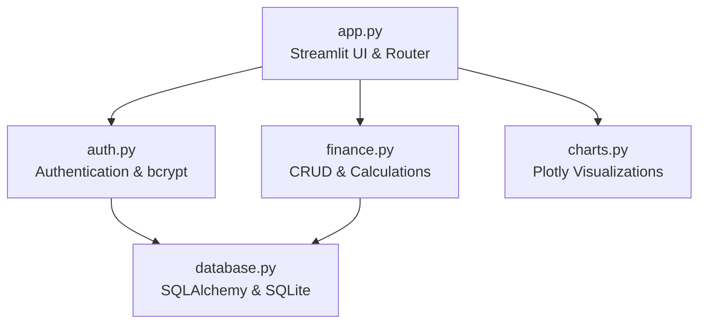
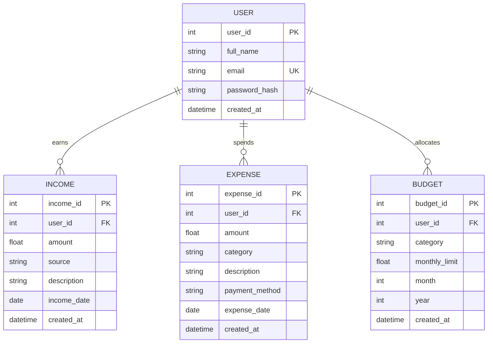

# 💳 FinTrack — Personal Finance Management System

**FinTrack** is a clean, modern, minimal, and professional Personal Finance Management System built **100% in Python and Streamlit**. It is engineered as a showcase portfolio project demonstrating database modeling, SQL data aggregation, interactive financial visualizations, secure authentication, and data analysis.

---

## 📌 Project Overview

Managing personal finances is critical for tracking cash flow, maintaining savings discipline, and avoiding overspending. **FinTrack** provides a comprehensive financial dashboard where users can:
- Record and categorize income and expenses.
- Set monthly budget limits per category and track real-time utilization.
- Analyze cash flow, savings rates, and spending trends with interactive charts.
- Maintain a unified transaction ledger with search and filters.
- Export customized financial reports as CSV files for spreadsheet modeling.

---

## 🚀 Key Features

| Module | Features & Capabilities |
|---|---|
| **🔐 Authentication** | User registration with validation, bcrypt password hashing, session state persistence, guest demo login. |
| **🏠 Dashboard** | 6 executive KPI cards (Income, Expense, Balance, Savings, Savings Rate, Transactions), 4 interactive Plotly charts, recent transaction ledger. |
| **💰 Income Management** | Add, edit, delete, search, and filter income transactions by source and date. |
| **💸 Expense Tracking** | Add, edit, delete, categorize expenses, and filter by payment method and date range. |
| **🎯 Budget Management** | Set monthly category caps, monitor visual progress bars with status badges (On Track, Warning, Exceeded), and view Budget vs. Actual spending comparisons. |
| **📊 Analytics & Insights** | Deep dive into average monthly expenses, top spending categories, monthly trends, and automated financial insights. |
| **📋 Unified Transactions** | Searchable, sortable, and filterable unified ledger combining incomes and expenses. |
| **📄 Financial Reports** | Generate and export 6 distinct financial reports (Ledger, Income, Expense, Monthly, Category, Budgets) as CSV files. |
| **📥 Demo Data Generator** | One-click sample data populator that seeds realistic multi-month financial records for instant presentation. |

---

## 🛠️ Technology Stack

FinTrack is built entirely in Python without any external JavaScript or frontend frameworks:

- **Python 3.11+**: Core programming language.
- **Streamlit**: Web application framework and reactive user interface.
- **SQLite**: Lightweight relational database engine (`data/finance.db`).
- **SQLAlchemy ORM (2.0+)**: Object-Relational Mapping for database schema, models, and queries.
- **Pandas**: Tabular data manipulation, time-series aggregation, and metrics calculation.
- **Plotly**: Modern interactive data visualizations (Bar charts, Donut charts, Line trends).
- **bcrypt**: Secure password hashing with cryptographic salt rounds.

---

## 🏗️ Architecture & Project Structure

The project follows a strictly modular 5-file architecture:

```text
Finance/
│
├── app.py              # Main Streamlit UI, page routing, and navigation
├── database.py         # SQLAlchemy engine, session maker, and ORM models
├── auth.py             # Authentication, password hashing, and session management
├── finance.py          # CRUD operations, financial calculations, and demo data
├── charts.py           # Interactive Plotly chart builders
├── requirements.txt    # Python dependencies
├── README.md           # Comprehensive project documentation
│
└── data/
    └── finance.db      # SQLite database file (created automatically)
```

### Module Responsibilities



---

## 🗄️ Database Design & Schema

FinTrack uses a relational database schema designed around a central `User` entity to ensure 100% data isolation between accounts.



### Database Tables Breakdown

1. **`users`**:
   - `user_id` (INTEGER, Primary Key, Autoincrement)
   - `full_name` (VARCHAR(100), NOT NULL)
   - `email` (VARCHAR(120), UNIQUE, NOT NULL, Indexed)
   - `password_hash` (VARCHAR(255), NOT NULL)
   - `created_at` (DATETIME, DEFAULT=UTC Now)

2. **`incomes`**:
   - `income_id` (INTEGER, Primary Key, Autoincrement)
   - `user_id` (INTEGER, Foreign Key -> `users.user_id`, NOT NULL, Indexed)
   - `amount` (FLOAT, NOT NULL)
   - `source` (VARCHAR(50), NOT NULL: Salary, Freelance, Business, Investment, Interest, Other)
   - `description` (VARCHAR(255))
   - `income_date` (DATE, NOT NULL, Indexed)
   - `created_at` (DATETIME, DEFAULT=UTC Now)

3. **`expenses`**:
   - `expense_id` (INTEGER, Primary Key, Autoincrement)
   - `user_id` (INTEGER, Foreign Key -> `users.user_id`, NOT NULL, Indexed)
   - `amount` (FLOAT, NOT NULL)
   - `category` (VARCHAR(50), NOT NULL: Food, Rent, Transportation, Shopping, Bills, etc.)
   - `description` (VARCHAR(255))
   - `payment_method` (VARCHAR(50), NOT NULL: UPI, Debit Card, Credit Card, Bank Transfer, Cash)
   - `expense_date` (DATE, NOT NULL, Indexed)
   - `created_at` (DATETIME, DEFAULT=UTC Now)

4. **`budgets`**:
   - `budget_id` (INTEGER, Primary Key, Autoincrement)
   - `user_id` (INTEGER, Foreign Key -> `users.user_id`, NOT NULL, Indexed)
   - `category` (VARCHAR(50), NOT NULL)
   - `monthly_limit` (FLOAT, NOT NULL)
   - `month` (INTEGER, NOT NULL)
   - `year` (INTEGER, NOT NULL)
   - `created_at` (DATETIME, DEFAULT=UTC Now)

---

## 📦 Installation & Setup Guide

### 1. Prerequisites
- Python 3.11 or higher installed on your system.

### 2. Clone or Navigate to Project Directory
```bash
cd Finance
```

### 3. Create a Virtual Environment
```bash
# On Windows
python -m venv venv

# Activate on Windows (PowerShell)
.\venv\Scripts\Activate.ps1
# OR on Windows (Command Prompt)
.\venv\Scripts\activate.bat

# On macOS/Linux
python3 -m venv venv
source venv/bin/activate
```

### 4. Install Dependencies
```bash
pip install -r requirements.txt
```

### 5. Launch Application
```bash
streamlit run app.py
```
Streamlit will automatically open `http://localhost:8501` in your browser.

---

## 🔄 Complete Application Workflow

```text
Register / Login
       │
       ▼
   Dashboard  ──────►  Overview KPIs & Charts
       │
       ├────────►  💰 Income (Record Earnings)
       │
       ├────────►  💸 Expenses (Track Spending)
       │
       ├────────►  🎯 Budgets (Set Caps & Monitor Progress)
       │
       ├────────►  📊 Analytics (Data Aggregations & Smart Insights)
       │
       ├────────►  📋 Transactions (Unified Filterable Ledger)
       │
       └────────►  📄 Reports (Preview & Instant CSV Download)
```

---

## 🧮 Financial Calculations & Logic

- **Total Income**: $\sum \text{Income Amounts}$
- **Total Expenses**: $\sum \text{Expense Amounts}$
- **Net Balance**: $\text{Total Income} - \text{Total Expenses}$
- **Net Savings**: $\text{Total Income} - \text{Total Expenses}$
- **Savings Rate**:
  $$\text{Savings Rate (\%)} = \begin{cases} \left(\frac{\text{Savings}}{\text{Total Income}}\right) \times 100 & \text{if Total Income} > 0 \\ 0 & \text{otherwise} \end{cases}$$
- **Budget Utilization**:
  $$\text{Usage (\%)} = \begin{cases} \left(\frac{\text{Actual Spent}}{\text{Monthly Limit}}\right) \times 100 & \text{if Limit} > 0 \\ 0 & \text{otherwise} \end{cases}$$
  - **On Track (Green)**: $\le 80\%$
  - **Warning (Amber)**: $> 80\%$ and $\le 100\%$
  - **Exceeded (Red)**: $> 100\%$

---

## 🎯 Data Analyst Interview Presentation Guide

When explaining this project during technical or data analyst interviews, highlight the following points:

1. **Relational Data Modeling & Normalization**:
   - Explain how `users`, `incomes`, `expenses`, and `budgets` are connected through foreign keys with cascade deletion.
2. **Session Security & Privacy**:
   - Point out that every query uses `st.session_state["user_id"]` to guarantee data isolation between users.
   - Explain password security using `bcrypt.gensalt()` and constant-time comparison `bcrypt.checkpw()`.
3. **Pandas Aggregations**:
   - Highlight how `finance.py` groups transactions by time periods (`strftime('%Y-%m')`) and categories, and calculates rolling month-over-month differentials.
4. **Data Visualization Principles**:
   - Mention why Plotly was chosen for interactive tooltips, percentage shares on donut charts, and comparative bar charts.
5. **Defensive Programming**:
   - Explain the zero-division safeguards for savings rates and budget percentages, and the safe fallback empty chart placeholders.

---

## 🔮 Future Enhancements

- 📈 Investment portfolio tracking with live stock/crypto price APIs.
- 🧾 Automated receipt scanning using OCR (Optical Character Recognition).
- 📧 Automated monthly email financial reports and budget alert notifications.
- 🎯 Long-term savings goal milestones (e.g. Vacation Fund, Emergency Fund).
